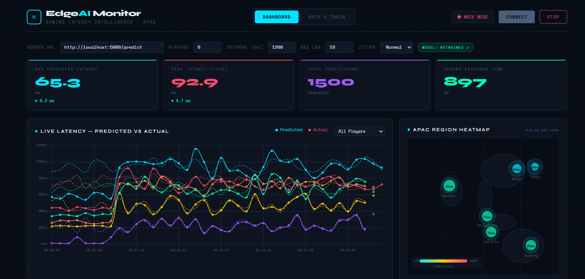
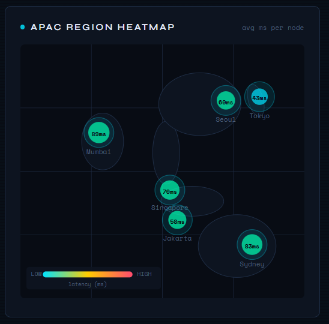
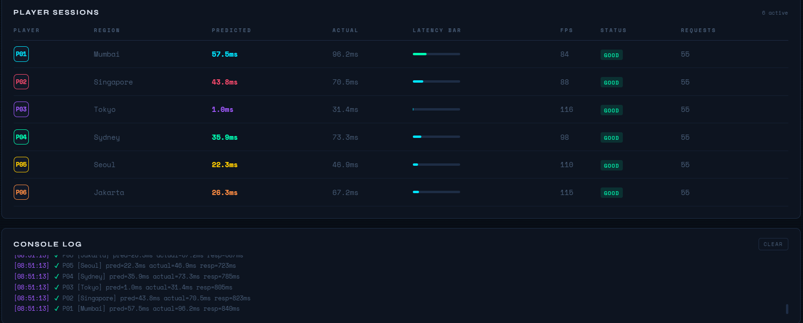
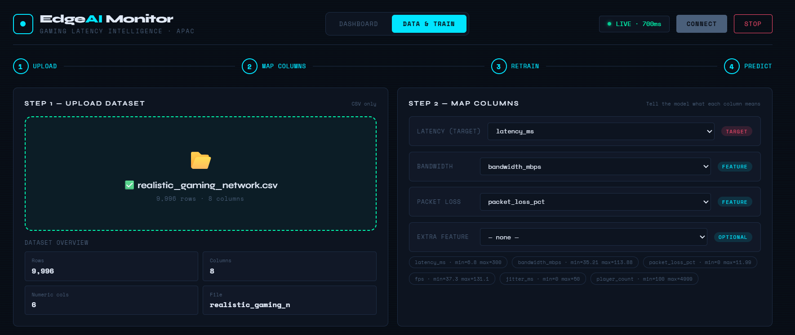

# 🎮 Edge AI — Gaming Latency Prediction System

> Real-time edge AI system that predicts network latency for multiplayer gaming using an LSTM neural network, served via a Flask REST API with a live monitoring dashboard and on-demand model retraining from custom datasets.


---

## 📖 Overview

This project demonstrates a full end-to-end edge AI pipeline for gaming performance optimization. It predicts network latency based on gameplay metrics — simulating how an edge server can improve responsiveness for multiplayer gaming in real time.

The system includes a live dashboard with an APAC region heatmap, per-player latency tracking, and an in-browser model retraining pipeline that lets you upload any CSV dataset, map columns, and retrain the LSTM model without touching code.

---

## 🏗️ Architecture

```
data_generator.py / realistic_data_generator.py
              ↓
      gameplay_data.csv / realistic_gaming_network.csv
              ↓
         pipeline.py  (LSTM training)
              ↓
      models/lag_model.pth
              ↓
       edge_server.py  (Flask REST API — port 5000)
              ↓
    edge_ai_dashboard_v2.html  (Live Dashboard)
         ├── Live latency chart (predicted vs actual)
         ├── APAC region heatmap (6 nodes)
         ├── Per-player session table
         └── Data & Train tab (CSV upload + retrain)
```

---

## 🛠️ Tech Stack

| Layer | Technology |
|---|---|
| Language | Python 3.11 |
| ML Model | PyTorch — LSTM sequence model |
| API Server | Flask + Flask-CORS |
| Data | NumPy, Pandas |
| Dashboard | HTML5, Chart.js, Vanilla JS |
| Containerization | Docker |

---

## 🔑 Key Features

### 🤖 LSTM Lag Predictor
- Sequence-based neural network (`input_size` configurable, `hidden_size=64`, `num_layers=2`)
- Trained on sequences of `[latency, fps]` or custom multi-feature inputs
- Predicts next-step latency in milliseconds

### ⚡ Edge Server (`edge_server.py`)
- `POST /predict` — accepts metric sequences, returns `predicted_latency` in ms
- `POST /upload-data` — accepts CSV datasets, returns column metadata
- `POST /retrain` — retrains LSTM on uploaded data in a background thread
- `GET /train-progress` — polls live epoch/loss for dashboard streaming
- `GET /health` — server status + current model config
- Auto-denormalization — scales model output back to real ms range
- Hot model swap — no server restart needed after retraining

### 📊 Live Dashboard (`edge_ai_dashboard_v2.html`)
**Dashboard Tab:**
- Live latency chart — predicted (solid) vs actual (dashed) per player
- APAC geo heatmap — 6 nodes (Mumbai, Singapore, Tokyo, Seoul, Jakarta, Sydney)
- Bubble size + color updates live based on average predicted latency
- Per-player session table with latency bar, FPS, status badge, request count
- 4 KPI cards — avg latency, peak latency with delta arrows, total predictions, server response time
- Config controls — players, poll interval, sequence length, jitter mode (Normal / High / Spike)
- Mock mode — falls back to simulated data if server unreachable

**Data & Train Tab:**
- CSV drag-and-drop upload with dataset overview stats
- Auto column detection — auto-maps latency, bandwidth, packet loss columns by name
- Column mapper — manually assign target and feature columns
- Training config — epochs, sequence length, learning rate
- Live loss curve — Chart.js graph updates every 250ms during training
- R² score + final loss displayed after completion
- "Go to Dashboard →" button — switches tab and updates model badge

### 🔄 Realistic Data Generator (`realistic_data_generator.py`)
Generates 10,000 rows of synthetic but realistic network data across 6 APAC regions with:
- Time-of-day latency patterns (peak hours = higher latency)
- Random network spikes (5% chance per sample)
- Congestion bursts (1% chance, sustained 5–20 samples)
- Correlated bandwidth, packet loss, FPS, and jitter columns

---

## 📁 Project Structure

```
edge-gaming-ai/
├── data/
│   ├── gameplay_data.csv              # initial synthetic data
│   └── realistic_gaming_network.csv   # realistic APAC network data
├── models/
│   ├── lag_model.pth                  # trained model weights
│   └── denorm_scale.json              # min/max for output denormalization
├── src/
│   ├── lag_model.py                   # LagPredictor LSTM definition
│   ├── edge_server.py                 # Flask REST API (v3)
│   └── pipeline.py                    # training + testing pipeline
├── data_generator.py                  # initial synthetic data generator
├── realistic_data_generator.py        # realistic APAC network data generator
├── client_simulator.py                # multi-player client simulation
├── main.py                            # entry point (train + serve)
├── edge_ai_dashboard_v2.html          # full live dashboard
├── Dockerfile                         # container config
└── README.md
```

---

## 🚀 Getting Started

### Prerequisites

```bash
python 3.11+
pip install torch flask flask-cors flask-socketio numpy pandas requests
```

### Step 1 — Generate Training Data

```bash
# Option A: Simple synthetic data (quick start)
python data_generator.py

# Option B: Realistic APAC network data (recommended)
python realistic_data_generator.py
```

### Step 2 — Train the Model

```bash
python main.py
```

This runs training (30 epochs), plots baseline vs optimized latency, then starts the edge server.

Or train only:

```bash
python -c "from src.pipeline import train_model; train_model()"
```

### Step 3 — Start the Edge Server

```bash
python src/edge_server.py
```

Server starts on `http://localhost:5000`. You should see:

```
✅ Model loaded (input_size=2)
🚀 Edge AI Server v3 on http://localhost:5000
```

### Step 4 — Open the Dashboard

Open `edge_ai_dashboard_v2.html` in your browser (no web server needed — just double-click).

Set the server URL to `http://localhost:5000/predict` and click **Connect**.

---

## 🧪 Test the API

```bash
# Health check
curl http://localhost:5000/health

# Predict latency
curl -X POST http://localhost:5000/predict \
  -H "Content-Type: application/json" \
  -d '{
    "metrics": [
      [50,60],[48,62],[52,58],[51,61],[49,60],
      [50,59],[53,62],[47,60],[50,61],[52,60]
    ]
  }'

# Expected response
{"predicted_latency": 47.3, "raw": 0.142}
```

---

## 📡 API Reference

### `POST /predict`

Predicts latency from a sequence of gameplay metrics.

**Request:**
```json
{
  "metrics": [[latency_ms, fps], [latency_ms, fps], ...]
}
```

**Response:**
```json
{
  "predicted_latency": 52.4,
  "raw": 0.161
}
```

---

### `POST /upload-data`

Upload a CSV dataset for retraining.

**Request:** `multipart/form-data` with field `file` (CSV)

**Response:**
```json
{
  "success": true,
  "rows": 10000,
  "columns": [
    {"name": "latency_ms", "dtype": "float64", "min": 5.2, "max": 298.4, "mean": 48.1},
    ...
  ]
}
```

---

### `POST /retrain`

Retrain the LSTM on uploaded data.

**Request:**
```json
{
  "target_col": "latency_ms",
  "feature_cols": ["bandwidth_mbps", "packet_loss_pct", "jitter_ms"],
  "epochs": 50,
  "seq_len": 10,
  "lr": 0.001
}
```

**Response:**
```json
{"status": "started"}
```

---

### `GET /train-progress`

Poll training progress (call every 250ms while retraining).

**Response:**
```json
{
  "running": true,
  "epoch": 23,
  "total_epochs": 50,
  "loss": 0.00412,
  "best_loss": 0.00389,
  "done": false,
  "accuracy": null
}
```

---

## 🐳 Docker

```bash
# Build
docker build -t edge-ai-gaming .

# Run
docker run -p 5000:5000 edge-ai-gaming
```

---

## 📊 Dashboard Column Mapping Guide

When uploading a CSV to the Data & Train tab, map columns as follows:

| Dashboard Field | Look for columns named... | Example |
|---|---|---|
| Latency (Target) | `latency_ms`, `ping`, `rtt`, `delay` | `52.3` ms |
| Bandwidth | `bandwidth_mbps`, `throughput`, `speed` | `87.4` Mbps |
| Packet Loss | `packet_loss_pct`, `loss`, `drop` | `1.2` % |
| Extra Feature | `jitter_ms`, `fps`, `player_count` | any numeric |

The system auto-detects column names on upload. You can override manually via the dropdowns.

---

## 📸 Screenshots

### Live Dashboard


### APAC Region Heatmap


### Live Latency - Predicted vs Actual Latency


### Player Sessions & console Logs


### Data & Model Train



## 🎯 Impact & Skills Demonstrated

This project blends multiple enterprise-relevant disciplines into one cohesive system:

| Skill Area | Implementation |
|---|---|
| **Machine Learning** | LSTM sequence model, online retraining, normalization, R² evaluation |
| **Backend Engineering** | REST API design, background threads, SSE streaming, hot model swap |
| **Networking Concepts** | Latency simulation, jitter injection, packet loss modeling, CORS |
| **Frontend Development** | Real-time charts, WebSocket-ready architecture, geo heatmap |
| **Data Engineering** | CSV ingestion, feature mapping, sequence building, train/test pipeline |
| **DevOps** | Docker containerization, multi-process architecture |

---

## 🔮 Roadmap

- [ ] WebSocket push-based predictions (replace polling)
- [ ] Transformer model replacing LSTM
- [ ] Kafka stream ingestion for real-time game telemetry
- [ ] Kubernetes autoscaling with Prometheus monitoring
- [ ] ONNX model export for faster edge inference
- [ ] A/B comparison panel — edge vs cloud baseline

---

## 📄 License

Apache 2.0 License — free to use, modify, and distribute with patent protection. Copyright 2025 Boshini.


---

<div align="center">
Built with ⚡ PyTorch · Flask · Chart.js
</div>